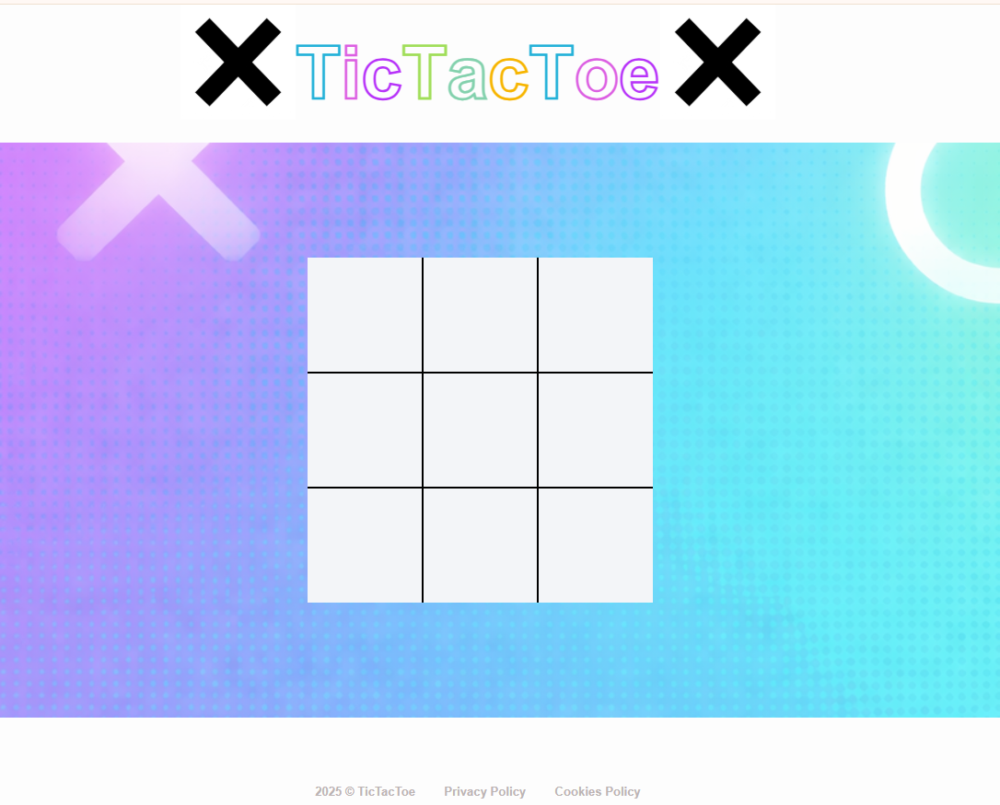
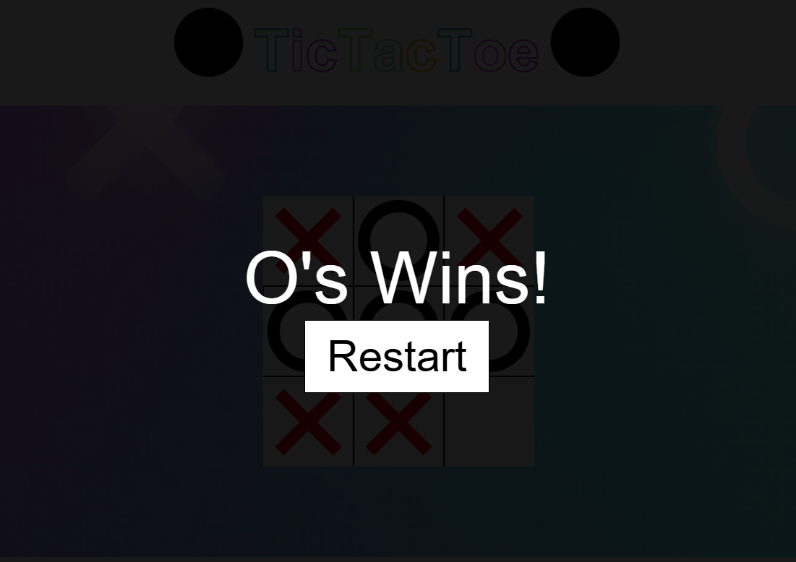

# Tic Tac Toe Web Game

A vibrant, interactive Tic Tac Toe game built to demonstrate DOM manipulation and game state logic in JavaScript.
This project features a colorful, high-energy UI and a fully functional game loop for two players.

*  [Live Site URL:](xxx)

#### 🚀 Features
* Dynamic Gameplay: Interactive $3 \times 3$ grid where players take turns placing 'X' and 'O'.
* Win Detection: JavaScript logic to automatically detect horizontal, vertical, and diagonal wins.
* Visual Flair: A colorful, gradient-background interface with high-contrast game pieces.
* Turn Management: Built-in logic to switch between players and prevent overwriting already-filled squares.

#### 🛠️ Tech Stack
*  HTML5: Used for the game board structure and heading typography.
*  CSS3: Implements a modern aesthetic with gradients, centered layouts, and specific styling for "X" (Red) and "O" (Black) symbols.
* JavaScript (ES6): Manages the game "engine," including state tracking, win-condition validation, and resetting the board.

## 🧠 Logic Breakdown
The game operates on three main JavaScript pillars:
* The State: An array of 9 strings (e.g., ["X", "", "O", ...]) representing the board.
* Winning Combinations: An array of arrays containing the index patterns for a win:$$[0,1,2], [3,4,5], [6,7,8], [0,3,6], [1,4,7], [2,5,8], [0,4,8], [2,4,6]$$
* The Listener: A function that triggers on every cell click to update the UI and check if the game has ended in a win or a draw.

## 🚧 Future Enhancements
* [ ] AI Opponent: Implement a "Minimax" algorithm for a single-player mode against the computer.
* [ ] Score Tracker: Add a persistent score counter for Player 1 and Player 2.
* [ ] Animations: Add a "fade-in" effect for pieces and a striking line through the winning three.
* [ ] Sound Effects: Add subtle "click" and "victory" audio cues.

#### Game_images:

 

